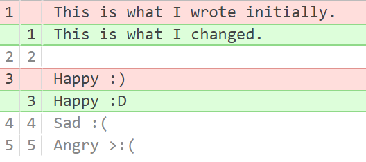
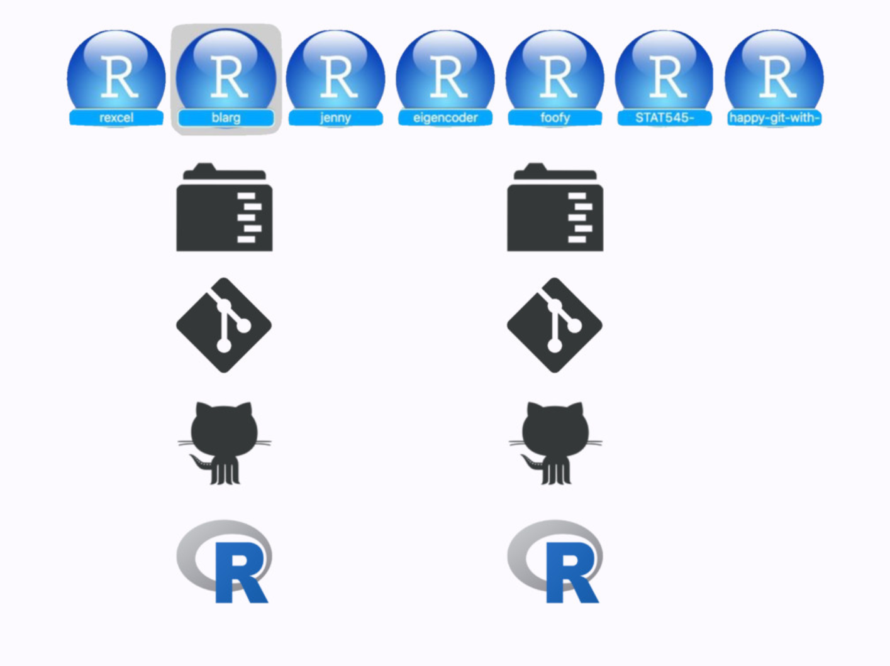
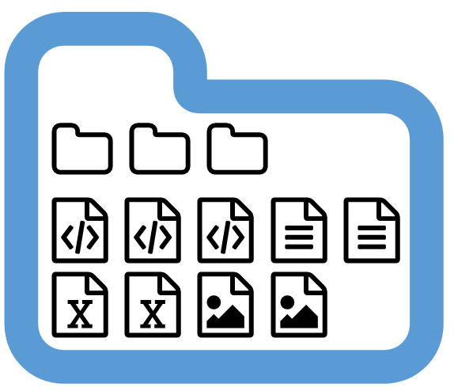
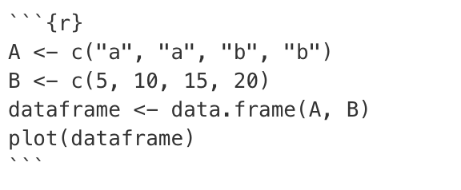
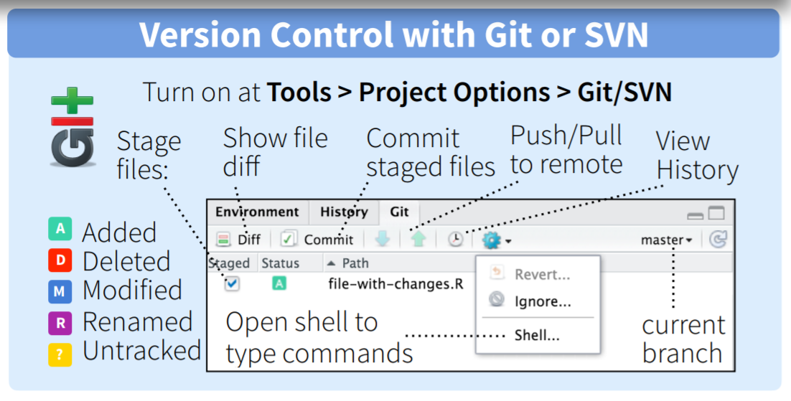
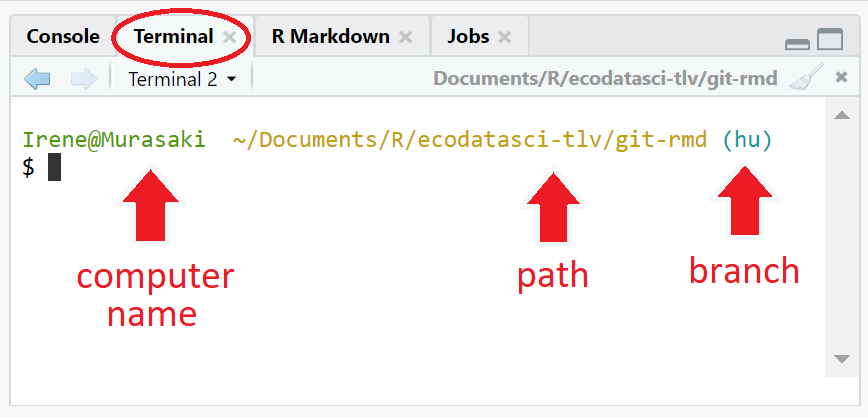

```{r setup, include=FALSE}
options(htmltools.dir.version = FALSE)
library(tidyverse)
library(icon)
```
class: exercise

# Administration

- The R group will meet every two weeks
- Tell us what you want to see in the meeting by filling the survey https://forms.gle/LxPoH2yZHCRVTcy99

<br>
**Email us with any questions:**  
Maria Novosolov (GeoGen): marianovosolov@gmail.com    
Hannah Lois Owens (CMEC): hannah.owens@sund.ku.dk   
Isolde van Riemsdijk (GeoGen): isolde.vanriemsdijk@naturalis.nl    
---
class: exercise

# `r icon::fa_check()` Check-in

To follow along, you should have:

- a GitHub account - [create one now](https://github.com/) if you don't have one already!
- git installed and connected to RStudio (detailed installation instructions [here](https://happygitwithr.com/install-git.html))

## Slides link: https://globedatasci-ku.github.io/git-rmd/pres.html

<br>  
**Tip:**You can get unlimited private GitHub repositories for _free_ (normally $7/month) with a university email! Sign up [here](https://education.github.com/pack).

---
This presentation is based on:

[Happy Git with R](http://happygitwithr.com)  
[NCEAS GitHub crash course](https://nceas.github.io/training-git-intro/getting-started-with-git-rstudio.html)  
[Ocean Health Index GitHub training](http://ohi-science.org/data-science-training/github.html)


---
background-image: url(http://www.phdcomics.com/comics/archive/phd101212s.gif)
background-position: center
background-size: auto 100%

---

# Why learn and use git/GitHub? 

- Version control
- Easy to share/distribute files, especially code/analyses
- Files accessible from anywhere with an internet connection
- Improves collaboration

--

_Git enables time travel & alternate realities!_

---
background-image: url(https://media.giphy.com/media/kxAX99ncvbPk4/giphy.gif)
background-position: center
background-size: cover

---
# git

.pull-left[
Version control system that lives on your computer. Think "track changes" for files
]

.pull-right[
<p>
]

---
# `r fa_git()` is not

.pull-left[
- a full backup
- meant for data, images, etc

git works best with _text-based_ files!
]

.pull-right[

]

---
# GitHub `r fa_github()`

"Dropbox" for git-based projects on the internet. 

- share/store analyses and functions
- browse past versions of code
- browse source code ([CRAN](https://github.com/cran),  [tidyverse](https://github.com/tidyverse/), [rOpenSci](https://github.com/ropensci))
- use packages not on CRAN (`devtools::install_github("account/repo")`)
- host web pages  

---
background-image: url(http://ohi-science.org/data-science-training/img/commit_compare_3.png)
background-position: center
background-size: auto 100%

---
# GitHub terminology

- **repository** or repo - project/folder `r fa_folder()`
- **local** - files stored on your computer `r fa_file_code()` `r fa_file_image()` `r fa_file_excel()`
- **remote** - files on github.com `r fa_github()`

---


class: inverse, center, middle

# GitHub: let's get oriented!  
---
class: exercise

Take a moment to explore this repository: 

# https://github.com/isteves/typos

- When was the .xlarge[repository `r emo::ji("folder")`] first created?
- What .xlarge[commits `r emo::ji("ring")`] have been made to the repository?
- What .xlarge[issues `r emo::ji("x")`] have been submitted?
- What .xlarge[pull requests `r emo::ji("please")`] (PRs) have been submitted?
- Are there any .xlarge[forks `r emo::ji("cutlery")`] or .xlarge[branches `r emo::ji("cactus")`]?
---
background-image: url(img/github-account.png)
background-position: center
background-size: 100%

---
background-image: url(img/github-account.png)
background-position: center
background-size: 100%
---
background-image: url(img/github-copies.png)
background-position: center
background-size: 100%
---
background-image: url(img/github-commits.png)
background-position: center
background-size: 100%
---
class: exercise

# Let's create a repo from scratch...  
### (choose a unique name!)

.center[

] 

- don't use special characters
- name it `something_meaningful` and not `too-long`
- note for advanced users: R packages cannot take underscores or dashes
---
class: inverse
background-image: url(http://ohi-science.org/data-science-training/img/create_repository_2.png)
background-position: center
background-size: 100%


---

class: inverse, center, middle

# Let's connect to RStudio!

---
class: inverse
background-image: url(http://ohi-science.org/data-science-training/img/clone_step1.png)
background-position: center
background-size: 100%
---
class: inverse
background-image: url(http://ohi-science.org/data-science-training/img/new_project_1.png)
background-position: center
background-size: 100%
---
class: inverse
background-image: url(http://ohi-science.org/data-science-training/img/new_project_2.png)
background-position: center
background-size: 100%
---
class: inverse
background-image: url(http://ohi-science.org/data-science-training/img/new_project_3.png)
background-position: center
background-size: 100%
---
class: inverse
background-image: url(https://media.giphy.com/media/vt4gALQsxCDmM/giphy.gif)
background-position: center
background-size: 100%
---
class: inverse
background-image: url(https://media.giphy.com/media/vt4gALQsxCDmM/giphy.gif), url(http://ohi-science.org/data-science-training/img/new_project_4.png)
background-position: bottom right, center
background-size: 30%, 100%

---
class: inverse, center, middle

# Inspect your repository

---
class: inverse
background-image: url(http://ohi-science.org/data-science-training/img/RStudio_IDE_git.png)
background-position: center
background-size: 100%

---
You now have a GitHub PROJECT!



https://speakerdeck.com/jennybc/workflow-you-should-have-one

---
# What's the deal with projects?

Each project is a self-contained set of files. Projects make it **easy to transfer** files to another computer because its **boundaries are clearly defined**

.center[

]
---
# Use relative paths inside projects
 
- looks cleaner
- works for other people/computers

```{r eval = FALSE}
read.csv("data/eilat_survey_2017.csv")
#rather than
read.csv("C:/Mariaי/phd/thesis/reef_surveys/data/eilat_survey_2017.csv")
```

You never have to use `setwd()` again! 

---
class: inverse, center, middle
# RMarkdown Demo & Exercise
---
#This presentation is based on:

https://rmarkdown.rstudio.com/lesson-1.html

https://bookdown.org/yihui/rmarkdown/

https://github.com/adam-p/markdown-here/wiki/Markdown-Cheatsheet

https://ourcodingclub.github.io/2016/11/24/rmarkdown-1.html

---
## __What is markdown?__

A lightweight text editor originally built to be presented as html

<p>

---
## __What is Rmarkdowm?__

A __one-stop-shop__ for writing code and sharing your work with various formats

.center[
<p>
]
---

# __Type of outputs for Rmarkdown__ 

- Research notebook ([R Notebook](https://bookdown.org/yihui/rmarkdown/notebook.html))
- Reports ([html](https://bookdown.org/yihui/rmarkdown/html-document.html), [pdf](https://bookdown.org/yihui/rmarkdown/pdf-document.html), or [word](https://bookdown.org/yihui/rmarkdown/word-document.html))
- Websites ([Rmarkdown wbsite](https://bookdown.org/yihui/rmarkdown/rmarkdown-site.html)\ [blogdown](https://bookdown.org/yihui/rmarkdown/blogdown-start.html))
- Books ([bookdown](https://bookdown.org/yihui/rmarkdown/books.html))
- Presentations ([xringan](https://bookdown.org/yihui/rmarkdown/xaringan.html)\ [ioslides](https://bookdown.org/yihui/rmarkdown/ioslides-presentation.html))

---
# __The different parts of Rmarkdown__
<p>

---
## YAML header 

- Must be enclosed in `---`
- output section changes based on the type of ducument

```r
---
title: "Edinburgh Biodiversity"
author: John Doe
date: 22/Oct/2016
output: html_document
---

```

---
## Code chunk

- The chunk must be enclosed between ` ``` ` and then `{r}` at the top
- keybord shortcut: ctrl + Alt + I (Windows) or cmd + Alt + I (MacOS)

<p>

---
## __Plain text__

Here you write everything that isn't a code by using markdown related symbols to create headers, bold text , etc.

---
## __Workflow of Rmd file__

<p>

You create an Rmd file, then you knit it with knitr package, it is passed to one of the rendering packages like pandoc (for html) or LaTex (for pdf), and the final format is created

---
class: exercise

# __Practice time__

1. Open an Rmd file in the project you created before
2. Choose the type of document you want to create
3. Write some plain text and some analyses in the code chunk
4. Click on the knit botton at the top bar (or ctrl/cmd + shift + K)

---
__Congradulations!!!__ 🎉 🎊 🥳 You created your first Rmd file!! `r emo::ji("smile")`

.center[
<p>
]

---
class: inverse, center, middle

# __Rmd plain text syntax__

<p>

---

# __Headers__

```{r}
# Header 1
## Header 2
### Header 3
#### Header 4
##### Header 5
###### Header 6
```


---
# Header 1
## Header 2
### Header 3
#### Header 4
##### Header 5
###### Header 6

---
## Alternatively, for H1 and H2, an underline-ish style:

```

Alt-H1
======

Alt-H2
------

```

Alt-H1
======

Alt-H2
------

---

# Highlight text


__Bold text__ ` __Bold__` or ` **Bold** `

_Italics_ ` _Italics_ ` or ` *Italics* `

~~strikethrough~~ `~~strikethrough~~`

---

### Use these two links to learn how to adapt the text and the code to your needs:

https://www.rstudio.com/wp-content/uploads/2015/02/rmarkdown-cheatsheet.pdf

https://ourcodingclub.github.io/2016/11/24/rmarkdown-1.html

---

class: inverse, center, middle

# __Other formats of Rmarkdown__

<p>

---

## The YAML header for website
Here is an example from the website
```r
---
title: "Visualizations in R"
author: "Alex Slavenko and Maria Novosolov"
output:  
  html_document:  
    toc: true  
    toc_float: true
    collapsed: true
    smooth_scroll: true
    toc_depth: 3
    runtime: shiny_prerendered
    # number_sections: true
---


```

---
class: inverse, center, middle

## Lets check how it looks online

https://ecodatasci-tlv.github.io/visualizations_in_r/
---
# __Books__

### - Writen similar to a webslite but has a different YAML header

### - Uses `bookdown` package to generate


---
class: center, middle

More information on __websites__ and guidlines on how to build them can be found [here](https://bookdown.org/yihui/rmarkdown/websites.html)

More information about how to build __books__ can be found [here](https://bookdown.org/yihui/rmarkdown/books.html)
---
class: inverse, center, middle
# Lets get back to git

--
# Basic git flow ~ life cycle of a relationship
---
# First, you **pull** them in


---
# Then, you **stage** & **commit**


---
# Finally, you **push** out babies 
.pull-left[
  
]
--


.pull-right[
## (or __push__ them away...) 


]


---
background-image: url(http://ohi-science.org/data-science-training/img/push_pull_clone.png)
background-position: center
background-size: auto 90%

---
# Sync from RStudio to GitHub

.center[

.img-small[
[](http://www.rstudio.com/wp-content/uploads/2016/01/rstudio-IDE-cheatsheet.pdf)
]
]

---
background-image:url(https://media.giphy.com/media/ycpCka5zPAUvMr6PU6/giphy.gif), url(http://ohi-science.org/data-science-training/img/pull.png)
background-position: bottom right, center
background-size: 30%, 100%
---
background-image:url(https://media.giphy.com/media/3QAUnTsafSMQE/giphy.gif), url(http://ohi-science.org/data-science-training/img/staged.png)
background-position: bottom right, center
background-size: 30%, 100%
---
background-image:url(https://media.giphy.com/media/3QAUnTsafSMQE/giphy.gif), url(http://ohi-science.org/data-science-training/img/commit.png)
background-position: bottom right, center
background-size: 30%, 100%
---
background-image:url(https://upload.wikimedia.org/wikipedia/commons/f/f1/Egg_laying_-_Harmonia_axyridis_%282127209595%29.jpg), url(http://ohi-science.org/data-science-training/img/push.png)
background-position: bottom right, center
background-size: 30%, 100%
---
background-image: url(img/github-flow.png)
background-position: center
background-size: 90%

---
class: exercise

# Your turn

1. Pull - make sure your branch is up-to-date
2. Make changes to `index.Rmd`. Save and knit
3. Stage `r emo::ji("check")` `index.Rmd` and `r emo::ji("check")` `index.html` 
4. Commit `r emo::ji("ring")`
5. Push - sync with remote repository

---
class: inverse, center, middle
# Host Rmd's online with GitHub Pages
---
background-image: url(img/github-pages.PNG)
background-position: center
background-size: 90%

In your repo settings (scroll down):
---
class: exercise

# Your turn

1. Turn on GitHub pages (from the repo home page, click Settings --> set source to _master branch_)
2. Check out your new web page!

## USERNAME.github.com/REPONAME

_Note:_ if your file was not named `index.html`, then you'll have to add `/FILENAME.html` to the end of the URL

---
# A few tricks

- Use `index.html` to set a home page for your repo: username.github.io/reponame = username.github.io/reponame/index.html
- use `toc_float` to add a floating table of contents to your RMarkdown webpage (more details [here](https://bookdown.org/yihui/rmarkdown/html-document.html))

```{r eval = FALSE}
---
output:
  html_document:
    toc: true
    toc_float: true
---
```

---
class: inverse, center, middle
# Let's collaborate!
---

# Contribute changes

If you want to work off of an existing repository on GitHub...

1. **Fork a repo** = make a copy of the repo on your account
2. **Make a branch** = start an alternate timeline
3. **Make a change**
4. **Examine the differences**

It's good practice to keep your "master" branch clean so that you can keep it synchronized with the original repository
---
class: exercise

# Your turn

https://github.com/isteves/typos

1. Fork the repo = make a copy of the repo on your account
2. Make a branch = start an alternate timeline
3. Make and commit a change
4. Submit a pull request
---
# Collaborating on a single repo

Eventually, you'll have to start thinking about .xlarge[merge conflicts]. This is especially true when you start to collaborate on a single repostory.

If you edit the same line of code or text as your collaborator, you will need to _manually_ resolve the conflict.

---
class: exercise

# Work in pairs

1. Choose one of your repos
2. Go into `Settings` --> `Collaborators`. Add your neighbor as a collaborator
3. Accept the email invitation

.img-small[

]
---

class: exercise

# Make a change

1. The collaborator - create a new git repository in RStudio
2. Both - make and commit a change ON THE SAME LINE
3. Collaborator - PUSH the change
4. Repo owner - PULL
5. Repo owner - resolve the conflict, COMMIT, and PUSH

---

class: inverse, center, middle
# GITting stuck - how to save yourself

---
# https://happygitwithr.com/

Ultimate guide for R/RStudio workflows with git/GitHub

- installation problems
- connecting GitHub to an RStudio project (or vice versa)
- setting up ssh
- how to "burn it all down" `r emo::ji("fire")`

---

# Use the terminal

Most of the resources online tell you what series of `git` commands to use to achieve your goal. The **terminal** is where you can type those commands

.center[
.img-small[

]]
---
# There's more!  

Check out these resources for step-by-step guides for:

- using `gitignore` to tell git what NOT to track
- dealing with merge conflicts
- collaborating using forks and branches
- burning it all down & starting afresh

[Happy Git with R](http://happygitwithr.com)  
[NCEAS GitHub crash course](https://nceas.github.io/training-git-intro/getting-started-with-git-rstudio.html)  
[Ocean Health Index GitHub training](http://ohi-science.org/data-science-training/github.html)